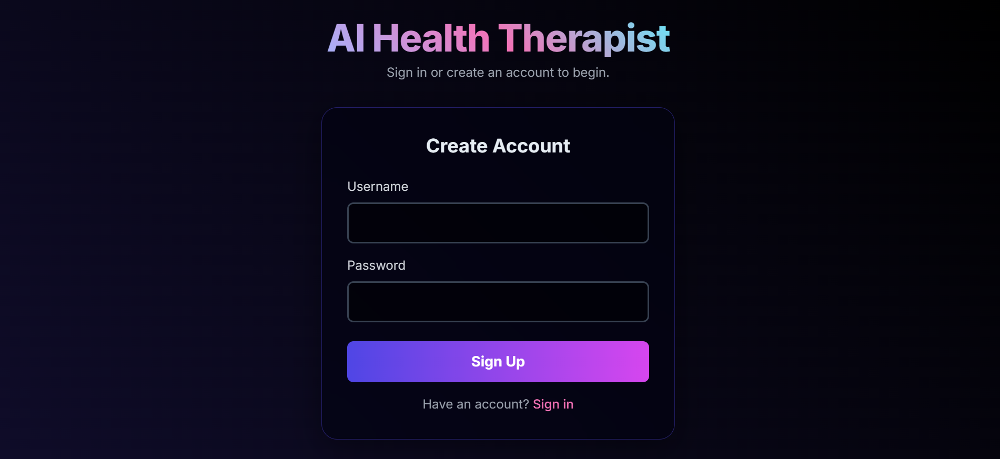
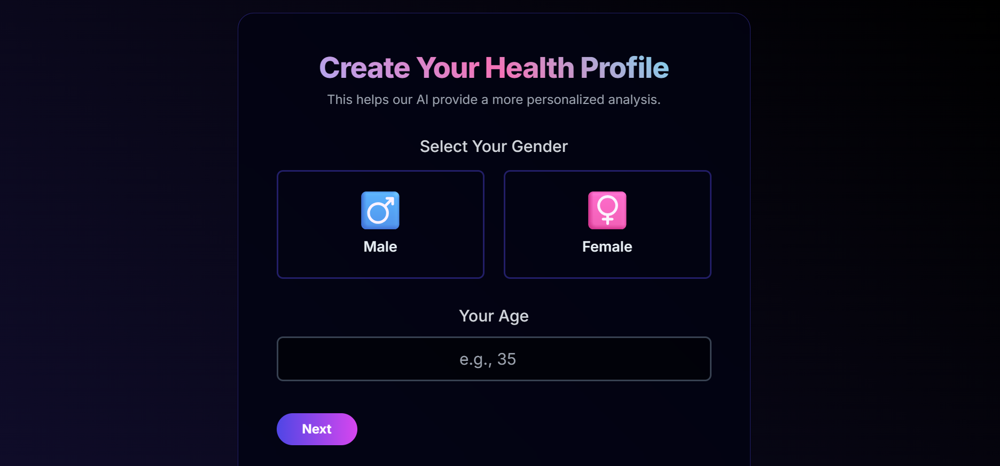
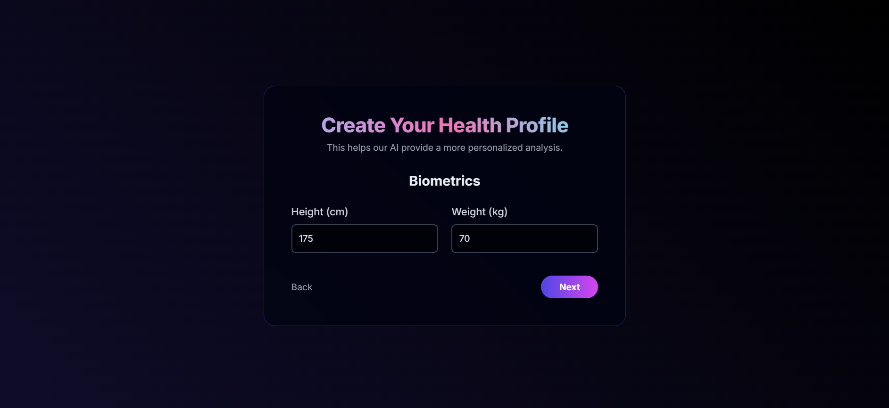
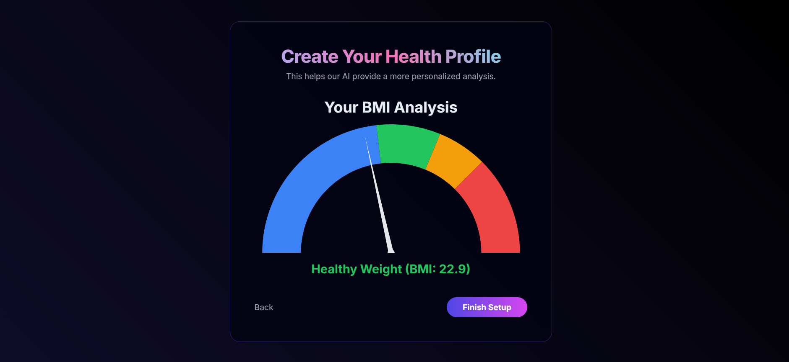
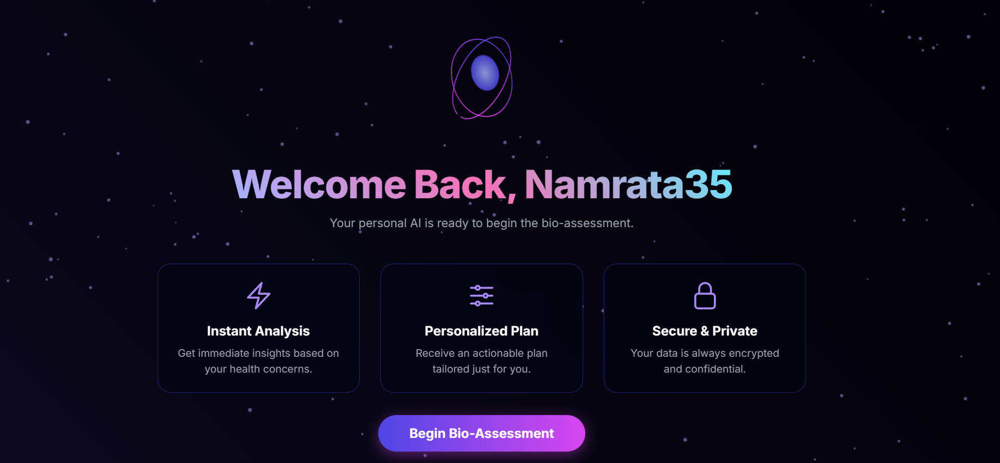
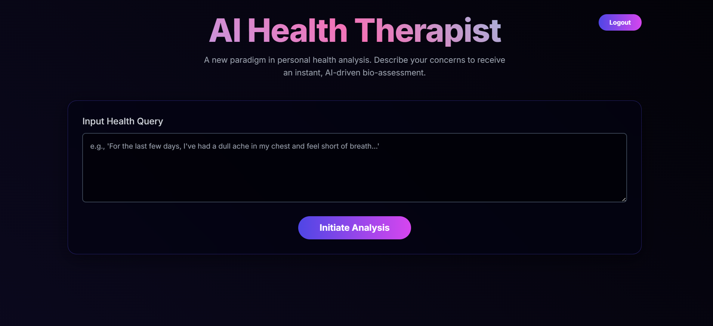
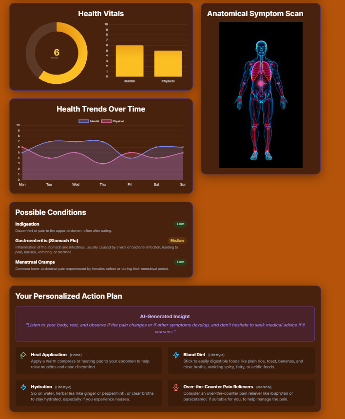

<div align="center">
  <br/>
  <h1>⚕️ AI Health Therapist ⚕️</h1>
  <p>
    <b>A full-stack, AI-powered web application that provides users with an instant, data-driven bio-assessment based on their health concerns.</b>
  </p>
  <p>
    <i>A collaborative project by Dristi Laskar and Namrata Nayak.</i>
  </p>
  
  
  
  
  
  
  

</div>

---

## 🌟 About The Project

AI Health Therapist is a cutting-edge personal health analysis tool. It addresses the need for immediate, accessible health information by leveraging the power of Google's Gemini AI. Users can describe their symptoms in natural language and receive a comprehensive, structured analysis, including potential conditions, recommended remedies, and personalized health scores—all presented through a dynamic and intuitive user interface.

This project demonstrates a full development lifecycle, from user authentication and data collection to secure, real-time AI integration and final deployment on a cloud platform.

---

## ✨ Project Preview

A visual walkthrough of the user's journey, from creation to analysis.

### 1. Secure Authentication & Onboarding
Users create a secure account and build a personalized health profile through a simple, multi-step process.
<p align="center">
  
  
  
  
</p>

### 2. Personalized Dashboard
After setup, the user is greeted by a personal dashboard, ready to begin their AI-powered bio-assessment.
<p align="center">
  
</p>

### 3. AI-Generated Health Report
The AI provides a comprehensive "Heartbeat Summary," including health vitals, trends, potential conditions, and a personalized, actionable plan.
<p align="center">
  
  
</p>

---

## 🚀 Key Features

* **Secure User Authentication**: JWT-based authentication with password hashing ensures user data is secure.
* **Personalized Health Profile**: A multi-step onboarding process collects user biometrics (age, gender, BMI) for more tailored AI analysis.
* **Real-time AI Analysis**: Integrates with the Google Gemini API to process user queries and generate structured health insights.
* **Dynamic Data Visualization**: Uses Chart.js to present mental/physical health scores and trends in an easy-to-understand format.
* **Interactive Anatomical Map**: Visually pinpoints symptom locations on a body map for enhanced clarity.
* **Full-Stack & Deployable**: A complete monolithic application built with the MERN stack (minus React), ready for cloud deployment.

---

## 🛠️ Tech Stack & Architecture

This project is a monolithic application where a Node.js/Express backend serves a static frontend, handles all API logic, and manages the database connection.

| Tier | Technology |
| :--- | :--- |
| **Frontend** |     |
| **Backend** |   |
| **Database** |   |
| **AI Integration**|  |
| **Deployment** |   |

---

## ⚙️ Getting Started

To get a local copy up and running, follow these simple steps.

### Prerequisites

* Node.js (v20.x or later)
* npm
* Git

### Local Installation

1.  **Clone the repository:**
    ```bash
    git clone [https://github.com/TechNamrata/AI_HEALTH_THERAPY.git](https://github.com/TechNamrata/AI_HEALTH_THERAPY.git)
    ```

2.  **Navigate to the backend directory:**
    ```bash
    cd AI_HEALTH_THERAPY/backend
    ```

3.  **Install NPM packages:**
    ```bash
    npm install
    ```

4.  **Create your Environment File:**
    Create a `.env` file inside the `backend` folder and add your secret keys:
    ```env
    MONGO_URI=your_mongodb_connection_string
    JWT_SECRET=your_jwt_secret_key
    GEMINI_API_KEY=your_google_gemini_api_key
    ```

5.  **Start the server:**
    ```bash
    npm start
    ```
    The application will be running on `http://localhost:3000`.

---

## 👥 Project Authors

This project was a collaborative effort.

<table>
  <tr>
    <td align="center">
      <a href="https://github.com/TechNamrata">
        <b>Namrata Nayak</b>
      </a>
      <br />
      <a href="https://github.com/TechNamrata">
        
      </a>
      <a href="https://www.linkedin.com/in/namrata-nayak-43b09b2ab/">
        
      </a>
    </td>
    <td align="center">
      <a href="https://github.com/DristiLaskar">
        <b>Dristi Laskar</b>
      </a>
      <br />
      <a href="https://github.com/DristiLaskar">
        
      </a>
      <a href="https://www.linkedin.com/in/dristi-laskar-7ab41728a/">
        
      </a>
    </td>
  </tr>
</table>

